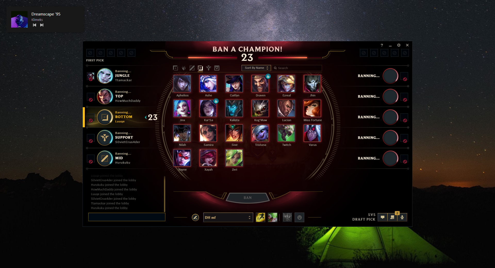

# Spotify overlay
Music player overlay for Spotify

### Installation

```
git clone https://github.com/BigBrain-Solutions/Spotify-Overlay.git
cd Spotify-Overlay
```

- inside the folder create ``.env`` file with ``SPOTIFY_TOKEN=`` your token

```
npm i
npm start
```

### Examples



